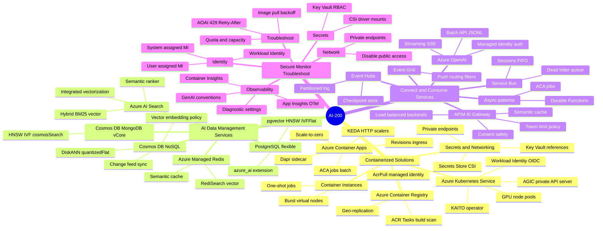
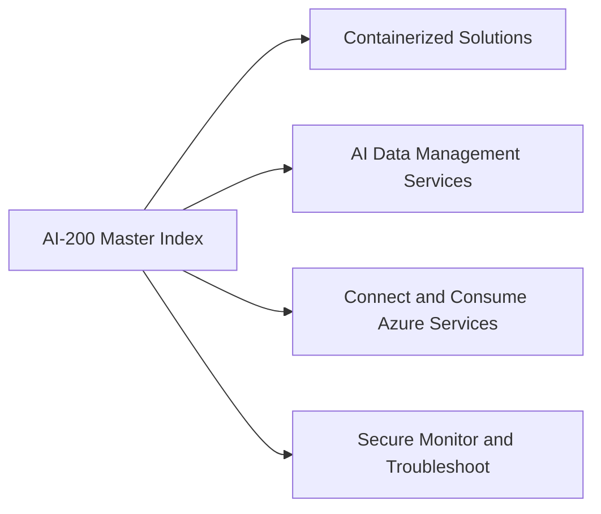
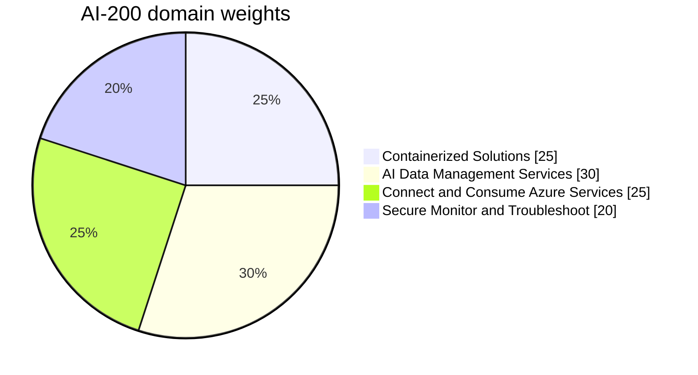

# AI-200 - Microsoft Azure AI Cloud Developer Associate - Visual Study Guide

> Concept-only study aid. No exam questions reproduced. Source PDF (if any) stays local + gitignored.

**Skills outline:** https://aka.ms/AI200-StudyGuide

## The 4 Exam Domains - Mind Map

## Domain map

## Domain weights

> Click a slice / legend label to jump to that chapter.

## Recommended study order

```mermaid
gantt
    title Suggested study plan
    dateFormat X
    axisFormat Day %d
    section Plan
    Containerized Solutions :t1, 0, 2d
    AI Data Management Services :t2, after t1, 2d
    Connect and Consume Azure Services :t3, after t2, 2d
    Secure Monitor and Troubleshoot :t4, after t3, 2d
```

---

**Next:** open [01-containerized-solutions.md](01-containerized-solutions.md)
