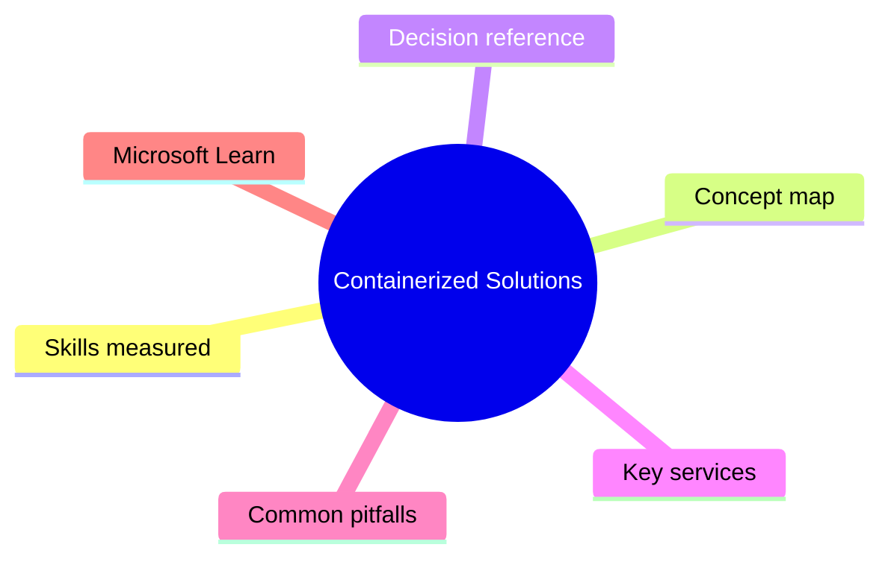
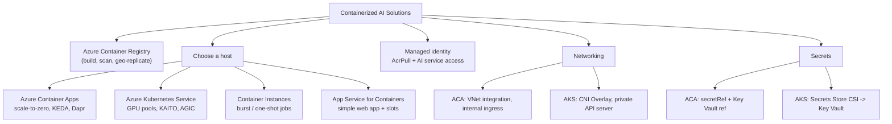

# Containerized Solutions

> Domain 1 of AI-200. Weight: 25%.

## Domain mind map

## Skills measured

- Build and publish container images with **Azure Container Registry (ACR)** (tasks, geo-replication, content trust, Microsoft Defender for Cloud scanning).
- Deploy AI workloads on **Azure Container Apps (ACA)** - revisions, ingress, scale rules (HTTP, KEDA event-driven, scale-to-zero), Dapr sidecar.
- Deploy AI workloads on **Azure Kubernetes Service (AKS)** - node pools, GPU node pools (NVIDIA `nvidia.com/gpu`), KAITO/Kubernetes AI Toolchain Operator, AGIC, Workload Identity.
- Choose the right container host: **App Service for Containers** vs **ACA** vs **AKS** vs **Container Instances (ACI)**.
- Wire **managed identity** for image pull from ACR (`AcrPull`) and for outbound calls to Azure AI / data services.
- Configure **secrets** (ACA secret refs, AKS Secrets Store CSI driver -> Key Vault).

## Concept map

## Decision reference

| When you see... | Pick... | Why |
|---|---|---|
| Spiky HTTP traffic, want scale-to-zero, no Kubernetes ops | **Azure Container Apps** | Built-in KEDA, revisions, Dapr; pay per request when idle. |
| GPU inference, custom CRDs, fine pod control, KAITO LLM hosting | **AKS** | Only host with full GPU node pools + KAITO; node-level customization. |
| One-off batch / build agent / quick demo | **Container Instances** | Per-second billing; fastest to start; no orchestration. |
| Web app + deployment slots + simple Docker image | **App Service for Containers** | Slot swap, easy auth, CD from ACR. |
| Pull from ACR without admin user / SAS | **Managed identity + `AcrPull` role** | No secrets in image config; works for ACA, AKS, App Service. |
| Mount Key Vault secrets in pod | **Secrets Store CSI driver + Workload Identity** (AKS) or **Key Vault reference** (ACA) | Avoid baking secrets into images or env files. |
| Need internal-only HTTP endpoint | **ACA internal ingress** or **AKS private cluster + internal LB** | Keeps app off the public internet. |
| Build image without local Docker | **ACR Tasks** (`az acr build`) | Cloud-side build, supports multi-arch and triggers. |

## Key services

- **Azure Container Registry (ACR)** - private OCI registry. Use **Premium** for geo-replication, content trust (signing), private endpoints, and CMK. **ACR Tasks** build/patch/scan on push.
- **Azure Container Apps (ACA)** - serverless containers on Kubernetes (KEDA + Envoy). Concepts: *environment* (per region), *app*, *revision*, *replica*, *scale rules*. Supports Dapr building blocks (state, pub/sub, secrets) and **jobs** for batch.
- **Azure Kubernetes Service (AKS)** - managed K8s. **Automatic** SKU = Microsoft-managed best practices; **Standard** SKU = full control. GPU pools via `--node-vm-size Standard_NC*_v3` and `--gpu-driver` install daemonset. **KAITO** auto-provisions GPU nodes + serves models (vLLM, transformers).
- **Azure Container Instances (ACI)** - single container or container group, fastest cold start, used as **virtual nodes** for AKS burst.
- **App Service for Containers** - PaaS web app from a container image. Built-in slots, Easy Auth, custom domains.

## Common pitfalls

- Forgetting to grant the workload identity `AcrPull` on the registry -> pods stuck in `ImagePullBackOff` / ACA revision shows "image pull failed".
- Setting `minReplicas: 0` on ACA but using a **TCP** scale rule - HTTP scale-to-zero only works for HTTP scaler; non-HTTP needs at least 1 replica or KEDA event source.
- AKS GPU pods scheduled on non-GPU nodes because the workload didn't request `nvidia.com/gpu` in `resources.limits`.
- Using ACR `admin user` instead of managed identity - blocked by most security baselines and rotates poorly.
- Confusing **ACA jobs** (run-to-completion) with **ACA apps** (long-running) - long batches on apps run forever and burn cost.
- Pulling huge model weights at container start - cold starts go from seconds to minutes. Bake weights into image or use **persistent volume** / Azure Files.

## Microsoft Learn

- [Implement container application hosting on Azure](https://learn.microsoft.com/training/paths/implement-container-app-hosting-azure/)
- [Deploy and manage apps on Azure Container Apps](https://learn.microsoft.com/training/paths/deploy-manage-apps-azure-container-apps/)
- [Deploy and monitor applications on Azure Kubernetes Service](https://learn.microsoft.com/training/paths/deploy-monitor-apps-azure-kubernetes-service/)
- [KAITO: Kubernetes AI Toolchain Operator](https://learn.microsoft.com/azure/aks/ai-toolchain-operator)

---

[<- Master Index](00-MASTER-INDEX.md) - [AI Data Management Services ->](02-ai-data-management.md)
