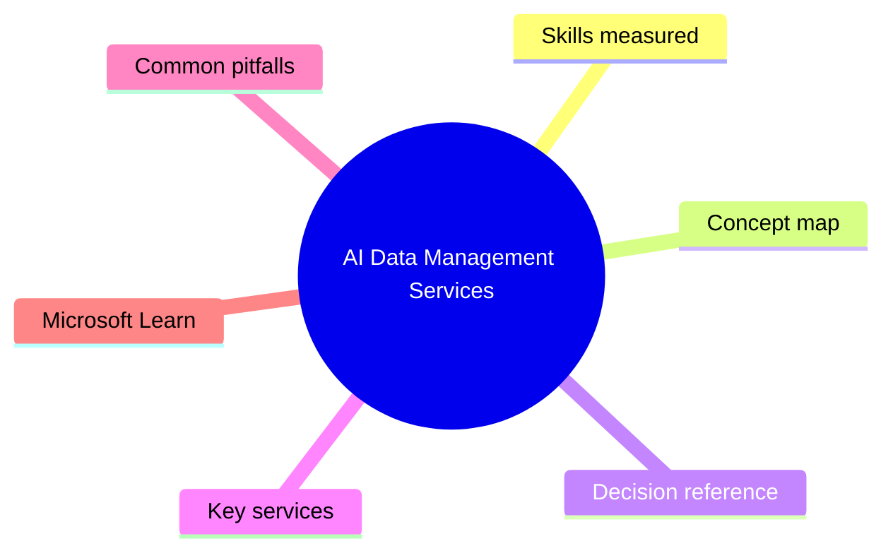
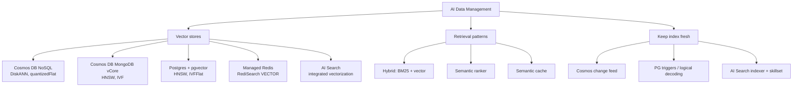

# AI Data Management Services

> Domain 2 of AI-200. Weight: 30%.

## Domain mind map

## Skills measured

- Implement vector search with **Azure Cosmos DB for NoSQL** (DiskANN/quantizedFlat) and **Cosmos DB for MongoDB vCore** (HNSW/IVF).
- Implement **Azure Database for PostgreSQL flexible server** with `pgvector` and `azure_ai` / `azure_local_ai` extensions.
- Implement **Azure Managed Redis** as a low-latency vector store and semantic cache (`RediSearch` FT.SEARCH with `VECTOR` field).
- Use **Azure AI Search** as a hybrid retrieval layer (BM25 + vector + semantic ranker, integrated vectorization).
- Choose the right embedding store for the workload (latency, scale, freshness, cost).
- Implement **change feed** / triggers to keep indexes in sync with the source of truth.

## Concept map

## Decision reference

| When you see... | Pick... | Why |
|---|---|---|
| Multi-tenant SaaS, partitioned by tenant, low-ms vector search | **Cosmos DB for NoSQL** with vector index | Single-region writes ms latency, vector + filter on partition key. |
| Already on Mongo / need Mongo wire protocol + vector | **Cosmos DB for MongoDB vCore** | Native HNSW/IVF, Mongo drivers unchanged. |
| Relational data + vectors in one place, SQL joins | **Postgres flexible server + `pgvector`** | Filter, join, vector in one query; HNSW for high recall, IVFFlat for speed. |
| Sub-millisecond cache for embeddings or LLM responses | **Azure Managed Redis** with vector + JSON | In-memory, semantic cache reduces token spend. |
| Enterprise search + chunking + ingestion pipelines | **Azure AI Search** with integrated vectorization | Built-in skillsets, semantic ranker, hybrid search out-of-the-box. |
| Need to keep vector index in sync with Cosmos data | **Change feed** -> Function/ACA job -> embed -> upsert | Pull-based, idempotent, exactly-once with lease container. |
| Cost-sensitive batch RAG ingestion | **AI Search indexer + Azure OpenAI embedding skill** | Fully managed, batched embeddings, throttling-aware. |

## Key services

- **Cosmos DB for NoSQL vector search** - enable `Microsoft.DocumentDB/EnableNoSQLVectorSearch`. Define `vectorEmbeddingPolicy` (path, dataType, distanceFunction, dimensions) + `indexingPolicy.vectorIndexes` with `type: "diskANN"` (best for >10k docs) or `quantizedFlat`. Query with `VectorDistance(c.embedding, @v)`.
- **Cosmos DB for MongoDB vCore** - `db.collection.createIndex({ embedding: "cosmosSearch" }, { kind: "vector-hnsw" | "vector-ivf", similarity: "COS" | "L2" | "IP" })`. Aggregation pipeline `$search` with `cosmosSearch`.
- **PostgreSQL + `pgvector`** - `CREATE EXTENSION vector;` then `CREATE INDEX ... USING hnsw (embedding vector_cosine_ops)`. The **`azure_ai`** extension calls Azure OpenAI directly from SQL: `azure_openai.create_embeddings(...)`.
- **Azure Managed Redis** - vector via `RediSearch` 2.x: `FT.CREATE idx ON HASH SCHEMA embedding VECTOR HNSW 6 TYPE FLOAT32 DIM 1536 DISTANCE_METRIC COSINE`. Use `JSON.SET` + JSONPath for structured docs.
- **Azure AI Search** - integrated vectorization wires AOAI embedding skill into the indexer. Hybrid query: send vector + text in one request; **semantic ranker** reranks top 50 with a cross-encoder.

## Common pitfalls

- Storing embeddings as JSON strings in Cosmos NoSQL - they must be `number[]` typed, with `vectorEmbeddingPolicy` declared **at container creation** (cannot be added later).
- `pgvector` defaults to `vector(2000)` max; using OpenAI `text-embedding-3-large` (3072 dims) requires explicit `vector(3072)` and `pgvector >= 0.7`.
- Forgetting `lists` parameter on IVFFlat - too few = slow recall, too many = slow build. Rule of thumb: `sqrt(rows)`.
- Redis vector search with `JSON` type requires `RediSearch` index `ON JSON` and JSONPath expressions, not HASH paths.
- AI Search **integrated vectorization** quietly throttles when AOAI quota is hit - check indexer execution history for 429s.
- Cosmos **change feed lease container** in the wrong region -> cross-region writes that violate latency SLO.

## Microsoft Learn

- [Develop AI solutions with Azure Cosmos DB for NoSQL](https://learn.microsoft.com/training/paths/develop-ai-solutions-azure-cosmos-db/)
- [Develop AI solutions with Azure Database for PostgreSQL](https://learn.microsoft.com/training/paths/develop-ai-solutions-azure-database-postgresql/)
- [Enhance AI solutions with Azure Managed Redis](https://learn.microsoft.com/training/paths/enhance-ai-solutions-azure-managed-redis/)
- [Vector search in Azure AI Search](https://learn.microsoft.com/azure/search/vector-search-overview)

---

[<- Containerized Solutions](01-containerized-solutions.md) - [Connect and Consume Azure Services ->](03-connect-consume-services.md)
