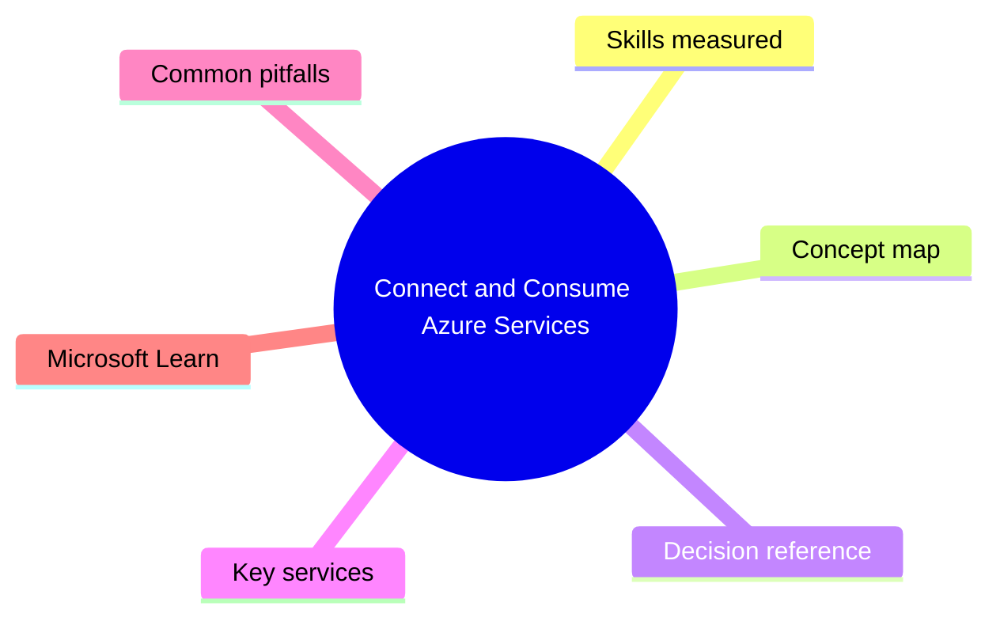
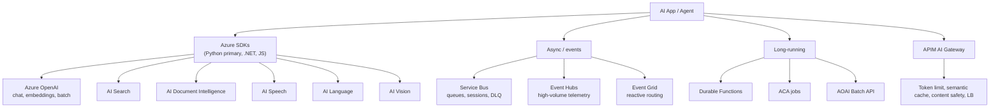

# Connect and Consume Azure Services

> Domain 3 of AI-200. Weight: 25%.

## Domain mind map

## Skills measured

- Consume **Azure AI services** via SDKs (Azure OpenAI, AI Search, AI Document Intelligence, AI Speech, AI Language, AI Vision, Content Understanding) with **managed identity** auth.
- Implement event-driven AI pipelines with **Azure Service Bus**, **Event Hubs**, and **Event Grid**.
- Implement async / long-running AI calls with **Durable Functions**, **ACA jobs**, and the **AOAI Batch API**.
- Wire **API Management (APIM)** as an **AI Gateway** (token rate limiting, semantic caching, content safety, load balancing across deployments).
- Use **Azure SDK for Python** retry/backoff (`AzureSdkRetryPolicy`), pagination, and streaming responses.

## Concept map

## Decision reference

| When you see... | Pick... | Why |
|---|---|---|
| Strict ordering per customer / session | **Service Bus queue with sessions** | FIFO per session-id; consumer locks the session. |
| Millions of telemetry events / second, replayable | **Event Hubs** | Partitioned log, consumer groups, capture to ADLS. |
| React to blob upload / resource event | **Event Grid** | Push delivery, filters, dead-letter to storage. |
| Chat completion that may take minutes | **Stream response** + heartbeat or **Durable Functions orchestrator** | Avoid HTTP timeouts and idempotency loss. |
| Bulk score 1M docs cheaply, no realtime SLA | **AOAI Batch API** | Up to 50% cheaper, 24h SLA, JSONL in/out via blob. |
| Multiple AOAI deployments behind one URL with quota smoothing | **APIM AI Gateway** with `azure-openai-token-limit` + load-balanced backends | Centralizes auth, observability, throttling. |
| Block jailbreak / PII in prompts | **APIM `llm-content-safety` / Prompt Shields** | Inline safety check before backend. |
| Idempotent AI side-effect (e.g., index write) | **Service Bus + dedup window** or **Cosmos `IfNoneMatch` ETag** | Prevents double-apply on retry. |

## Key services

- **Azure OpenAI** - models hosted in your tenant, two auth modes: **API key** or **managed identity (`Cognitive Services User`)**. Streaming via SSE. Batch via JSONL upload to AOAI files endpoint.
- **Azure Service Bus** - **queues** (1:1) and **topics** (1:n with subscriptions + filters). Premium tier for VNet, geo-DR, large messages (100 MB). **Sessions** for ordered processing, **DLQ** auto-routes poison.
- **Event Hubs** - partitioned event ingestion, **consumer groups** are independent cursors. Use **EventProcessorClient** with **checkpoint store in blob** for at-least-once.
- **Event Grid** - system topics (Azure resource events), custom topics, partner topics, MQTT broker. Strong filters reduce downstream load.
- **Azure Functions / Durable Functions** - bindings for SB/EH/EG/Cosmos. **Orchestrator** function = workflow; **activity** = unit of work; **fan-out / fan-in** for parallel doc processing.
- **APIM AI Gateway policies**: `azure-openai-token-limit`, `azure-openai-emit-token-metric`, `llm-semantic-cache-lookup` / `-store`, `llm-content-safety`, plus standard `set-backend-service` for load balancing across regions/deployments.

## Common pitfalls

- Calling AOAI with a static API key from inside an ACA / AKS pod when MI is available - fails security review and rotation is manual.
- Using **Service Bus peek-lock** without renewing the lock on long AI calls -> message redelivered while still being processed -> duplicates.
- Event Hubs **EventProcessorClient** without a checkpoint store -> on restart you replay the entire retention window.
- Putting an LLM call inside a synchronous HTTP function with default 230s timeout - long completions fail. Stream or move to Durable.
- APIM `azure-openai-token-limit` set per-IP for a multi-tenant app -> all tenants share the same bucket. Key on subscription / API key / managed identity instead.
- Forgetting to enable **Diagnostic settings** on AOAI - no per-deployment token usage in Log Analytics.

## Microsoft Learn

- [Integrate backend services for AI solutions](https://learn.microsoft.com/training/paths/integrate-backend-services-ai-solutions/)
- [Implement message- and event-based solutions](https://learn.microsoft.com/training/paths/implement-message-event-solutions/)
- [Azure API Management AI gateway capabilities](https://learn.microsoft.com/azure/api-management/genai-gateway-capabilities)
- [AOAI Batch API](https://learn.microsoft.com/azure/ai-services/openai/how-to/batch)

---

[<- AI Data Management Services](02-ai-data-management.md) - [Secure Monitor and Troubleshoot ->](04-secure-monitor-troubleshoot.md)
