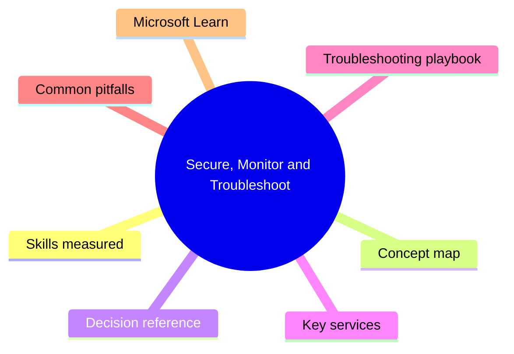
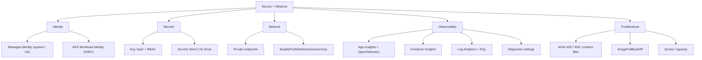

# Secure, Monitor and Troubleshoot

> Domain 4 of AI-200. Weight: 20%.

## Domain mind map

## Skills measured

- Authenticate workloads with **managed identity** (system + user-assigned) and **workload identity** (AKS).
- Manage secrets, keys, and certificates with **Azure Key Vault** + RBAC.
- Lock down network paths: **private endpoints**, service endpoints, **disable public network access**.
- Instrument apps with **Application Insights** + **OpenTelemetry** (Python `azure-monitor-opentelemetry` distro).
- Use **Container Insights**, **Log Analytics**, KQL for AKS / ACA / Function diagnostics.
- Diagnose AOAI **429 / 408 / 503** errors, throttling, content filter responses, deployment quotas.

## Concept map

## Decision reference

| When you see... | Pick... | Why |
|---|---|---|
| App needs to call AOAI from ACA | **System-assigned MI + `Cognitive Services User`** on the AOAI resource | No keys; rotates automatically. |
| Multiple ACA apps share one identity | **User-assigned managed identity** | Same principal across apps; reuse RBAC. |
| AKS pod needs Azure resource access | **Workload Identity (OIDC federation)** | Pod token federated to Entra; scoped per service account. |
| Mount Key Vault secrets in pod | **Secrets Store CSI driver + Workload Identity** | No secret in env; auto-rotates. |
| Block AOAI from the public internet | **Private endpoint** + `publicNetworkAccess: Disabled` | Traffic stays in VNet, audited via Defender. |
| Trace LLM calls with prompt + tokens | **App Insights + OpenTelemetry GenAI semantic conventions** | `gen_ai.system`, `gen_ai.usage.input_tokens`, etc. |
| AKS pod CPU spiking | **Container Insights -> KQL `Perf` / `KubePodInventory`** | Built-in workbooks. |
| AOAI returns 429 | **Backoff with `Retry-After`**, switch to a load-balanced APIM, or scale TPM | Throttling = quota; `Retry-After` is authoritative. |
| AOAI returns 400 with `content_filter` | Inspect `prompt_filter_results` / `content_filter_results` | The model refused; tune prompt or filter severity. |

## Key services

- **Microsoft Entra ID + managed identity** - eliminates secrets. **System-assigned** lifecycle = the resource; **user-assigned** is independent and reusable.
- **Azure Key Vault** - **RBAC mode** (preferred) over access policies. Roles: `Key Vault Secrets User` (read), `... Secrets Officer` (write).
- **Application Insights** - workspace-based; ingest via `azure-monitor-opentelemetry` distro (Python) or `Microsoft.ApplicationInsights.AspNetCore`. Captures custom events, dependencies, and exceptions.
- **Container Insights** - addon for AKS; built-in `Perf`, `ContainerLog`, `KubeEvents` tables. Configure via the **ConfigMap** for log filtering and stdout/stderr enable.
- **Azure Monitor diagnostic settings** - send AOAI / Search / Cosmos / KV resource logs to Log Analytics; mandatory for audit.
- **Microsoft Defender for Cloud (Containers)** - image scanning in ACR, runtime threat detection in AKS.

## Troubleshooting playbook

| Symptom | First check | Then |
|---|---|---|
| ACA revision unhealthy | `az containerapp logs show` and revision events | Health probe path returning non-2xx; image fails to pull. |
| AKS pod `ImagePullBackOff` | `kubectl describe pod` | Identity has `AcrPull`? Private registry reachable from node subnet? |
| AOAI 429 with `Retry-After` | App Insights `dependencies` filtered to AOAI host | Increase deployment TPM, add second deployment, fan-out via APIM. |
| AOAI 408 timeout | Streaming enabled? | Move to streaming; bump client timeout above model latency p99. |
| Secret rotation broke pods | Pod env vs CSI mount? | Switch to CSI / Key Vault reference for auto-rotation; redeploy after rotation. |
| App Insights missing LLM traces | OpenTelemetry instrumentor loaded? | Enable `OpenAIInstrumentor` (azure-monitor-opentelemetry >= 1.6) and confirm sampling >0. |

## Common pitfalls

- Granting `Contributor` on a subscription to a managed identity "to make it work" - violates least privilege. Use scoped data-plane roles.
- Disabling public network access on AOAI without configuring a private endpoint first -> app outage.
- App Insights without **sampling** in high-volume scenarios -> 5x bill, ingestion throttled.
- Using `kubectl logs` instead of Log Analytics for AKS retention - pods are ephemeral, so logs vanish on restart.
- Treating `429` from AOAI as a transient retryable error without honoring `Retry-After` -> hammers the service and prolongs throttling.

## Microsoft Learn

- [Manage identities and access for Azure AI services](https://learn.microsoft.com/azure/ai-services/authentication)
- [OpenTelemetry on Azure with Application Insights](https://learn.microsoft.com/azure/azure-monitor/app/opentelemetry-overview)
- [Container Insights for AKS](https://learn.microsoft.com/azure/azure-monitor/containers/container-insights-overview)
- [Troubleshoot AOAI errors](https://learn.microsoft.com/azure/ai-services/openai/how-to/troubleshoot)

---

[<- Connect and Consume Azure Services](03-connect-consume-services.md) - [Master Index ->](00-MASTER-INDEX.md)
