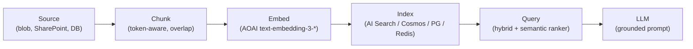

# Extra AI-200 Concepts

Topics that show up indirectly on the exam and are commonly mis-answered.

## Embedding models on Azure OpenAI

| Model | Dimensions | When to use |
|---|---|---|
| `text-embedding-3-small` | 1536 | Default; cheap, strong baseline. |
| `text-embedding-3-large` | 3072 (configurable) | Higher recall on dense semantic tasks. |
| `text-embedding-ada-002` | 1536 | Legacy; only for migration. |

- Always pin **`api-version`** in the SDK; don't pass `model` raw - call the **deployment name**.
- Truncate input to model max tokens before embedding; long inputs silently truncated by older SDKs.

## RAG ingestion blueprint

- Chunk by **tokens, not characters**; aim for 300-500 tokens with 10-15% overlap.
- Store **source URI + chunk index + last-modified** to enable surgical updates.
- Use **change feed** (Cosmos) or **indexer high-water-mark** (AI Search) for incremental sync.

## Streaming AOAI

- Set `stream=true` and consume Server-Sent Events; emit a heartbeat to the client every few seconds for proxies.
- Don't buffer the whole stream server-side - forward chunks; capture the final `usage` object only on the last chunk.

## Idempotency patterns

- Cosmos: `IfMatch`/`IfNoneMatch` on `ETag` for optimistic concurrency.
- Service Bus: `MessageId` + duplicate detection window (Premium tier).
- Outbox pattern: write event row in same DB transaction; relay polls and publishes.

## AOAI quotas vs limits

- **Quota** = TPM (tokens per minute) + RPM, set per deployment, per region.
- **Limits** = global service ceilings (regions, max content length, concurrent batch jobs).
- 429 = quota; 503 from a region = capacity. Solve with multi-region deployment + APIM LB.

## Dapr building blocks (ACA)

- `state` - Cosmos/Redis/SQL; consistent state with versioning.
- `pubsub` - Service Bus / Event Hubs broker.
- `secrets` - Key Vault component.
- `bindings` - input/output to blob, queue, etc.
- Useful for portable code across ACA/AKS without coupling to one SDK.
