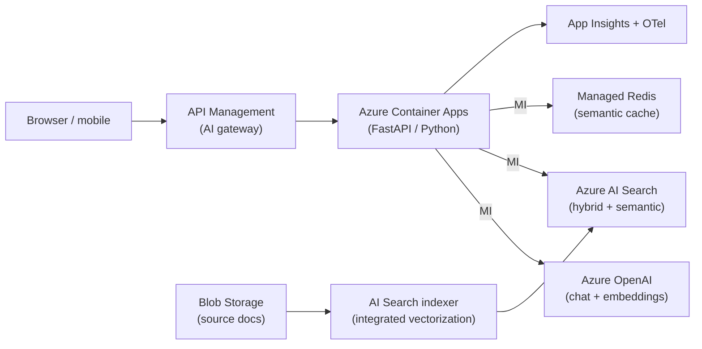
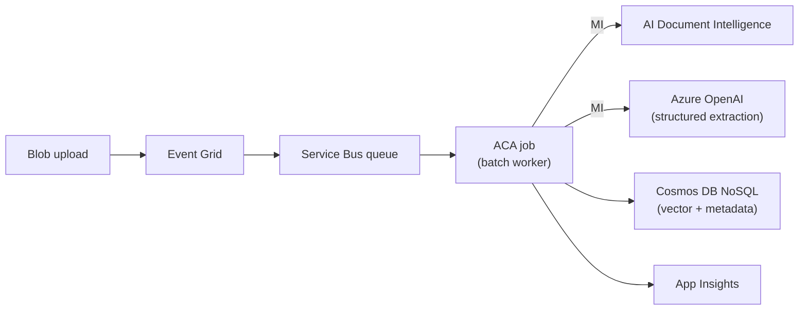
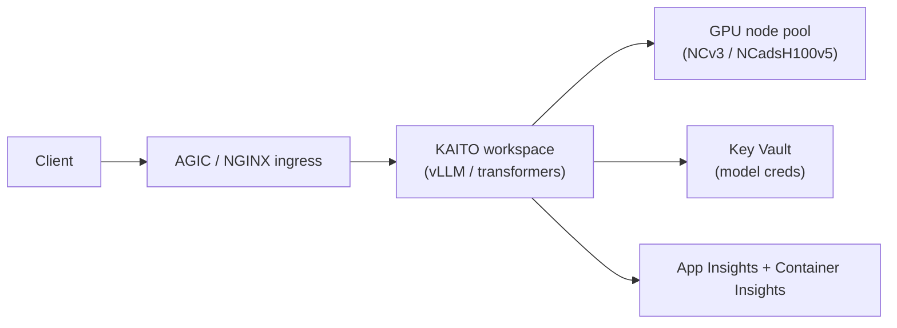
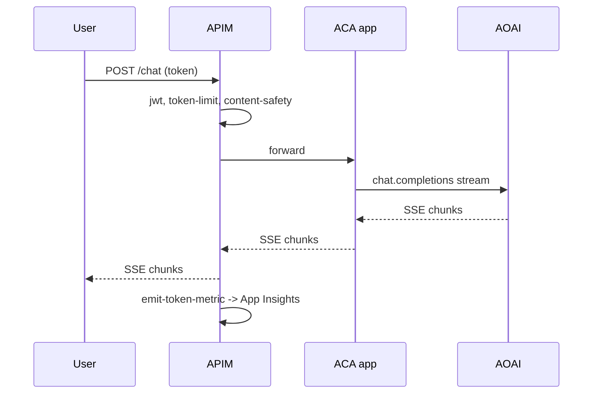

# Reference Architectures - AI-200

## RAG on Azure (containerized)

## Event-driven document processing

## GPU model serving on AKS with KAITO

## Async chat with streaming + APIM cost guardrails

